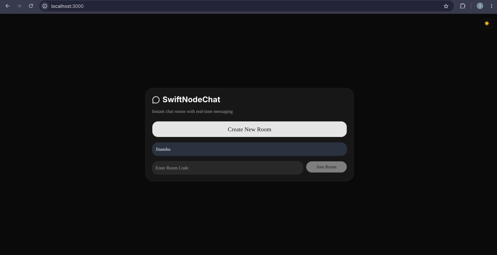
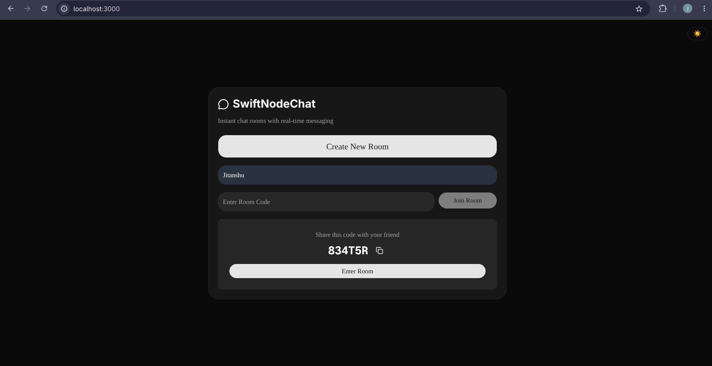
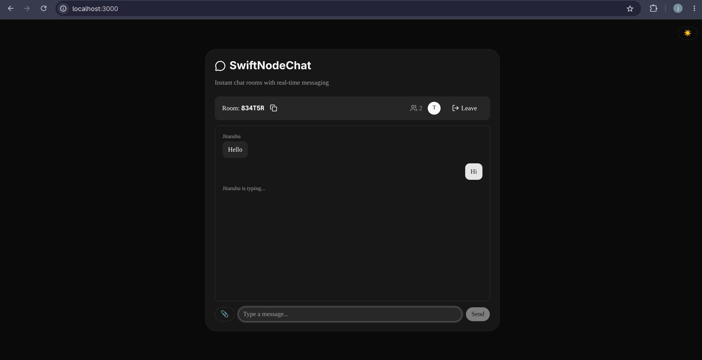
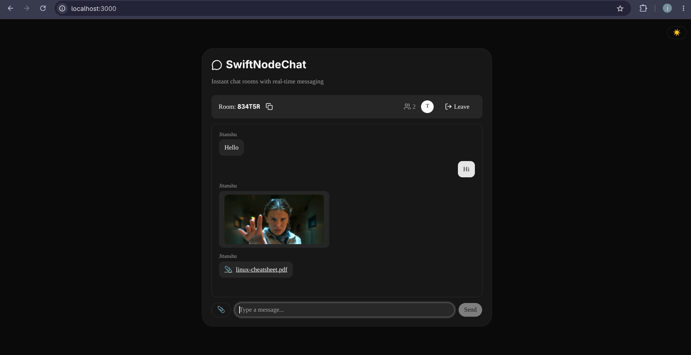

# SwiftNodeChat 💬

A real-time chat application with instant chat rooms, file/image sharing, typing indicators, and dark/light theming — built as a Turborepo monorepo with a Next.js client and a Node.js/Socket.IO server.

## Screenshots

| Lobby | Room Code Share |
|-------|------------------|
|  |  |

| Typing Indicator | Image & File Sharing |
|-------------------|------------------------|
|  |  |

## Features

- **Instant chat rooms** — create a room and share the generated code, or join with a code
- **Real-time messaging** via Socket.IO, with message persistence in MongoDB
- **Typing indicators** — see when other participants are typing
- **File & image sharing** — uploads are stored via Cloudinary
- **Graceful reconnects** — brief disconnects (e.g. a page refresh) don't immediately remove a user from the room
- **Dark / light theme toggle**
- **Room auto-cleanup** — inactive rooms and messages expire automatically (TTL indexes / in-memory cleanup)

## Tech Stack

| Layer      | Technology |
|------------|------------|
| Frontend   | Next.js, React, TypeScript, Tailwind CSS, shadcn/ui |
| Backend    | Node.js, Express, Socket.IO |
| Database   | MongoDB (Mongoose) |
| File storage | Cloudinary |
| Monorepo   | Turborepo (npm workspaces) |
| Deployment | Client → Vercel, Server → Render |

## Project Structure

```
swiftnodechat/
├── apps/
│   ├── client/          # Next.js frontend
│   │   ├── app/
│   │   ├── components/
│   │   ├── hooks/
│   │   └── lib/
│   └── server/           # Express + Socket.IO backend
│       └── index.ts
├── turbo.json
└── package.json
```

## Getting Started

### Prerequisites

- Node.js 18+
- A MongoDB connection string (MongoDB Atlas or local)
- A Cloudinary account (cloud name, API key, API secret)

### 1. Clone and install

```bash
git clone <your-repo-url>
cd swiftnodechat
npm install
```

`npm install` at the root installs dependencies for both `apps/server` and `apps/client` via npm workspaces.

### 2. Configure environment variables

**`apps/server/.env`**
```env
PORT=4000
MONGODB_URI=your-mongodb-connection-string
CLOUDINARY_CLOUD_NAME=your-cloud-name
CLOUDINARY_API_KEY=your-api-key
CLOUDINARY_API_SECRET=your-api-secret
```

**`apps/client/.env.local`**
```env
NEXT_PUBLIC_SOCKET_URL=http://localhost:4000
```

> Never commit real `.env` files. Use `.env.example` files for placeholders and keep secrets out of version control.

### 3. Run in development

From the project root:

```bash
npm run dev
```

This starts both the server (port 4000) and the client (port 3000) via Turborepo. Alternatively, run each app individually:

```bash
# Terminal 1
cd apps/server && npm run dev

# Terminal 2
cd apps/client && npm run dev
```

### 4. Build for production

```bash
npm run build
```

This builds both apps. To run the built server: `cd apps/server && npm start`. To run the built client: `cd apps/client && npm start`.

## Deployment

- **Client** (`apps/client`) is deployed on [Vercel](https://vercel.com). Set `NEXT_PUBLIC_SOCKET_URL` to your deployed server's URL in the Vercel project's environment variables.
- **Server** (`apps/server`) is deployed on [Render](https://render.com). Set `MONGODB_URI`, `CLOUDINARY_CLOUD_NAME`, `CLOUDINARY_API_KEY`, and `CLOUDINARY_API_SECRET` in the Render service's environment variables.

## Core Flows

- **Create a room** — enter a name, click "Create New Room", get a room code, then enter the room
- **Join a room** — enter a room code and a name from a second browser/tab to join an existing room
- **Send messages** — messages appear in real time for everyone in the room
- **Typing indicator** — "X is typing..." appears while a user types and clears shortly after they stop
- **Share files/images** — upload via the attachment button; images open in a zoom modal, other files open/download in a new tab
- **Reconnect** — a brief disconnect (e.g. page refresh) does not immediately show the user as having left; a user leaving on purpose (via "Leave") is reflected immediately
- **Leave a room** — explicitly leaving updates the participant count for everyone else right away

## License

This project is licensed under the MIT License.
